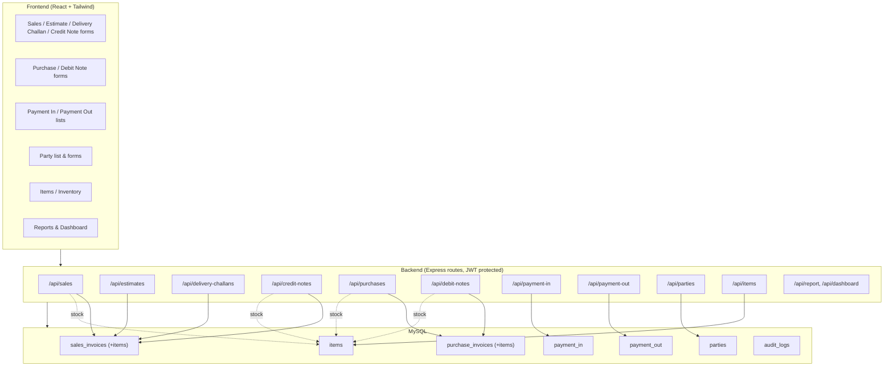
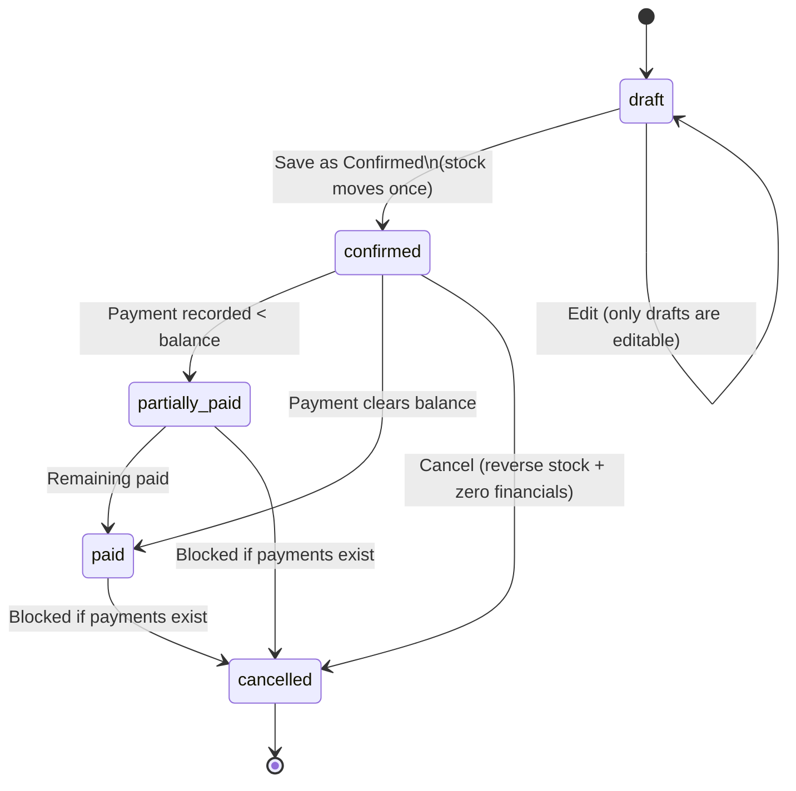
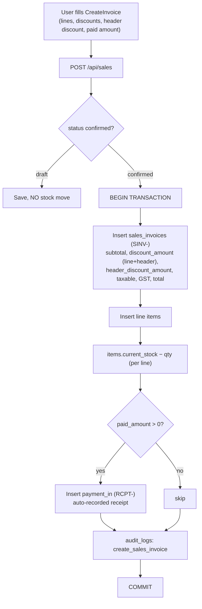
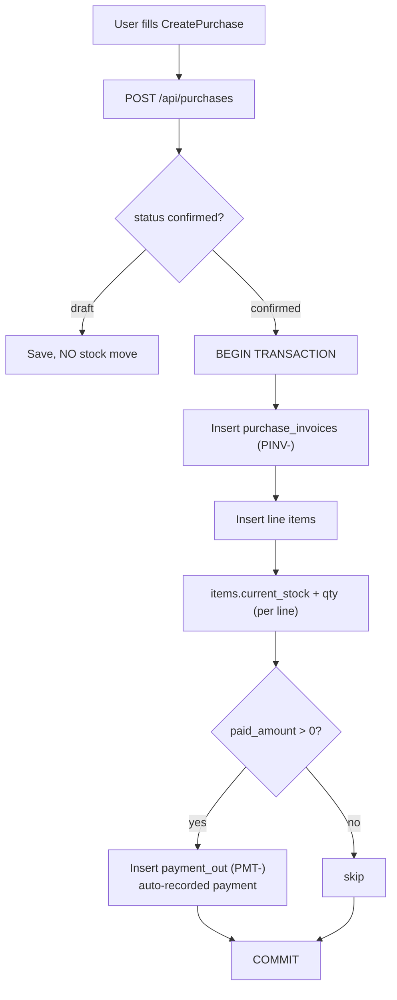
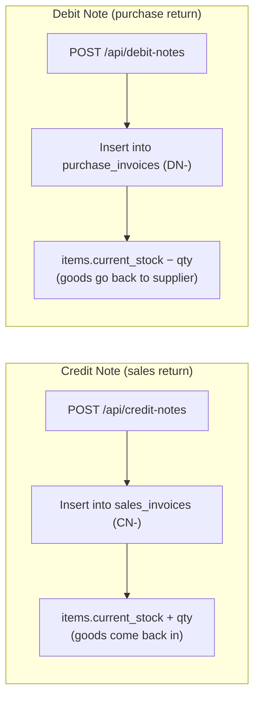
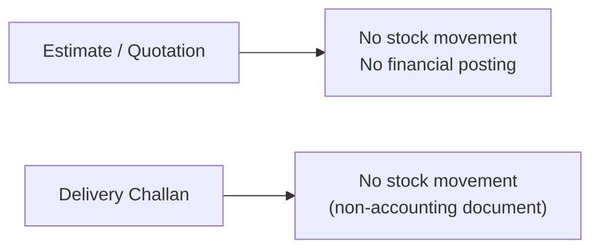
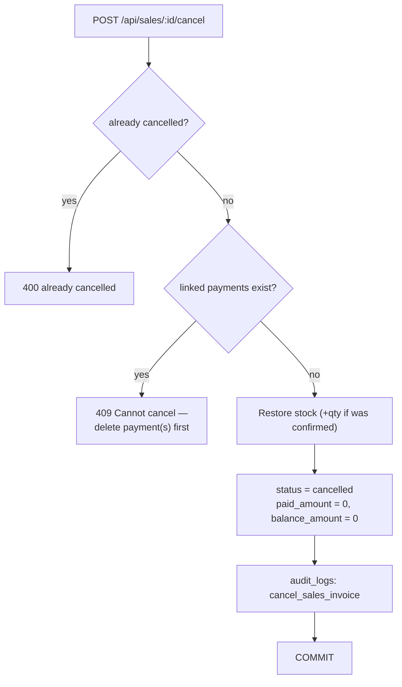
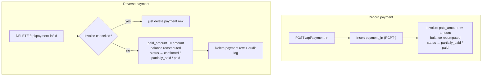
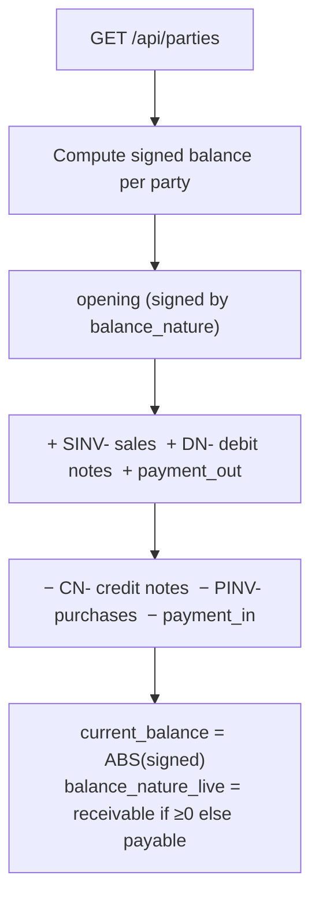
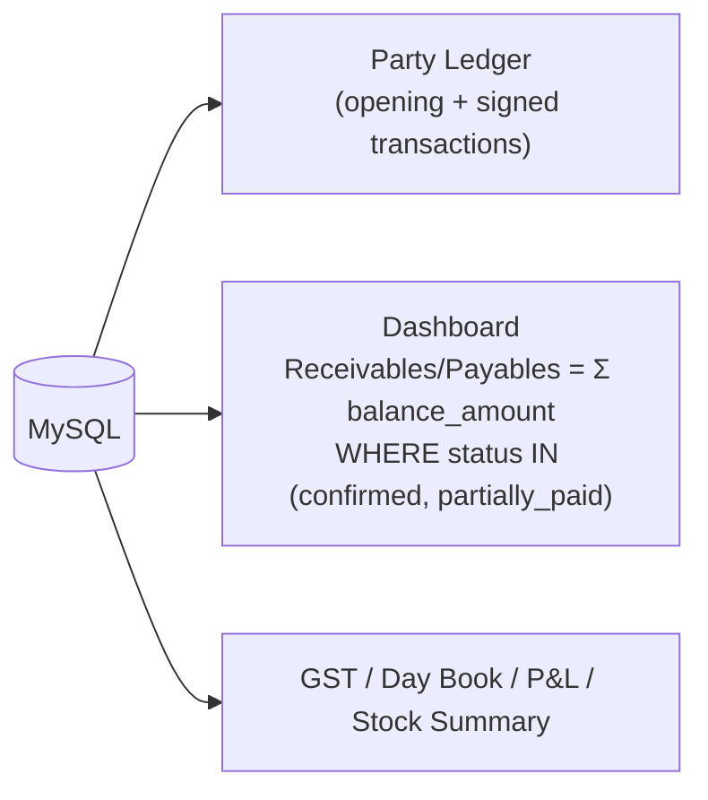

# Flowventory — Business Flow & Module Architecture

> GST Billing, Inventory & Accounting. React + Tailwind (frontend) · Node.js + Express + MySQL (backend) · JWT auth.
> This document shows how each module works end-to-end, including the production-hardening fixes (stock movement, cancel/reversal, payments, party balance, subtotal rounding, header discount).

---

## 1. High-level system map



### Shared tables by document prefix (critical design)
`sales_invoices` and `purchase_invoices` are **shared** across several document types, distinguished by the `invoice_no` / `bill_no` prefix.

| Table | Prefix | Document | Stock effect |
|-------|--------|----------|--------------|
| `sales_invoices` | `SINV-` | Sales Invoice | **− Subtract** |
| `sales_invoices` | `CN-` | Credit Note (sales return) | **+ Add** |
| `sales_invoices` | `EST-` | Estimate / Quotation | None |
| `sales_invoices` | `DC-` | Delivery Challan | None |
| `purchase_invoices` | `PINV-` | Purchase Bill | **+ Add** |
| `purchase_invoices` | `DN-` | Debit Note (purchase return) | **− Subtract** |

> Every route filters by its own prefix (`WHERE invoice_no LIKE 'CN-%'`, etc.). Aggregations and the reconciliation script **must** respect these prefixes.

---

## 2. Document status lifecycle



- **Stock moves on the confirm transition only** (status not `draft`/`cancelled`), so confirming once = one stock movement.
- **Only `draft` documents are editable** (PUT enforces this).
- **Cancel** restores stock and zeroes `paid_amount`/`balance_amount`, but is **blocked (HTTP 409) if any linked payment exists** — the payment must be deleted first.

---

## 3. Sales Invoice flow (SINV-)



**Totals math (frontend and backend agree):**
- `subtotal = Σ round2(qty × rate)` — each line rounded before summing (rounding fix).
- `taxable = max(0, Σ line_taxable − header_discount)` — header discount reduces taxable base; **GST stays per-line** (not recomputed after header discount).
- `total = taxable + CGST + SGST + IGST + round_off`.

---

## 4. Purchase Bill flow (PINV-)



---

## 5. Returns: Credit Note (CN-) & Debit Note (DN-)



- Credit Note **adds** stock on confirm; its cancel **subtracts** back (with negative-stock guard).
- Debit Note **subtracts** stock on confirm; its cancel **adds** back.

---

## 6. Estimate (EST-) & Delivery Challan (DC-)



These are non-inventory, non-financial documents by design — they never touch `items.current_stock` or party balances.

---

## 7. Cancel / Reversal flow (Sales & Purchase)



Purchase cancel mirrors this: it **subtracts** the previously added stock and **blocks if it would go negative** (goods already sold/consumed), and blocks if any `payment_out` is linked.

---

## 8. Payments: record & reverse



- Payment Out (`PMT-`, against `purchase_invoices`) works identically.
- Auto-recorded payments (from invoices created with an upfront `paid_amount`) are ordinary payment rows — deleting one reverses the invoice balance, which then allows the invoice to be cancelled.

---

## 9. Party balance (computed live)



- The stored `parties.current_balance` column is **no longer trusted for display** — the list API computes it live so it always matches the Party Ledger report.
- Frontend `PartyList.js` totals and per-row badges use `balance_nature_live` (falls back to stored `balance_nature`).
- Only **confirmed/partially_paid/paid** documents count toward the balance.

---

## 10. Reports & Dashboard



Dashboard and the Party Ledger compute figures **dynamically** from invoices and payments (never from the stale `current_balance` column).

---

## 11. Data integrity guardrails (summary of fixes)

| Area | Guarantee |
|------|-----------|
| Stock | Moves exactly once on confirm; reversed on cancel; never silently goes negative on purchase/return cancel. |
| Cancel | Reverses stock **and** zeroes financials; blocked if payments are linked. |
| Payments | Have delete/reverse endpoints + UI; reversal restores invoice balance & status. |
| Upfront paid amount | Always materialized as a payment row, so ledger = invoice. |
| Subtotal | Frontend and backend both sum **rounded per-line bases** — no paisa drift. |
| Header discount | Stored in dedicated `header_discount_amount`; edits round-trip exactly. |
| Party balance | Computed live from transactions; consistent across list, ledger, dashboard. |

---

## 12. Reconciliation (one-time / periodic)

`npm run reconcile-stock` (dry-run) → `npm run reconcile-stock -- --apply` (write).

```
expected_stock = opening_stock
               + Σ purchases (PINV-)      − Σ debit notes (DN-)
               − Σ sales (SINV-, excl. EST-/DC-) + Σ credit notes (CN-)
               + Σ manual adjustments (audit_logs: adjust_stock)
```

The script compares `expected_stock` vs `items.current_stock` per item and corrects mismatches only when `--apply` is passed.
